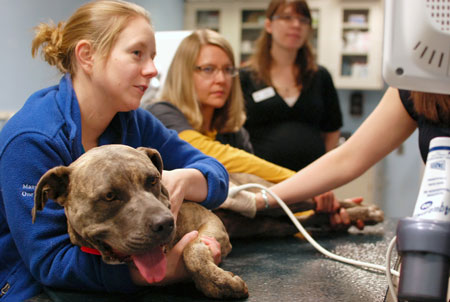



## Transcriptional control of cutaneous immunopathology during human Leishmaniasis 

_Leishmania braziliensis_ infection presents on a spectrum of clinical manifestations, all of which are associated with immunopathology.  To identify transcriptional programs driving this pathology, we work closely with [Phil Scott's lab](http://www.vet.upenn.edu/people/faculty-clinician-search/PHILLIPSCOTT) and colleagues in Brazil to carry out expression profiling of clinical biospy samples from confirmed cases of human cutaneous Leishmaniasis.  This project was the first to dissect the changes that occur in the skin early after infection, and made the case for a ‘metapathway’ that is initiated early during lesion formation and drives pathology.  Building on these studies we are now moving on to profile paired lesion and blood samples to identify serum biomarkers of disease subtypes and progress.  Finally, by combining these studies with similar genomics experiments in mouse models of cutaneous Leishmaniasis from the Scott lab, we can identify conserved pathways that can be studied in mice: __Collaborators: [Phil Scott](http://www.vet.upenn.edu/people/faculty-clinician-search/PHILLIPSCOTT), [Edgar Carvalho](https://scholar.google.com/citations?user=O7tWQX8AAAAJ&hl=en)__

## Comparative genomics of veterinary Staphylococcal species

Staphylococci are a leading cause of skin and soft tissue infections in both human and veterinary medicine, and antibiotics used treat these infections in veterinary hospitals are often the same as those used to treat humans. There has been a dramatic increase in the prevalence of both methicillin- and multidrug-resistant staphylococcal infections in humans as well as companion and agricultural animals. From a ‘One-Health’ perspective, this overlap in antibiotic use and resistance raises concerns over the potential spread of antibiotic resistance genes. In this project we used a combination of bacterial whole genome sequencing and comparative genomics to identify druggable pathways conserved in veterinary-associated staphylococcal species, but absent from those largely associated with human disease, ultimately identifying a novel treatment strategy for Staph infections in companion animals.  This project uses long-read single-molecule sequencing (PacBio and Oxford Nanopore) for the de novo assembly of bacterial genomes. __Collaborators: [Dan Morris](http://www.vet.upenn.edu/people/faculty-clinician-search/DANIELMORRIS), [Christine Cain](http://www.vet.upenn.edu/people/faculty-clinician-search/CHRISTINECAIN), [Shelley Rankin](http://www.vet.upenn.edu/people/faculty-clinician-search/SHELLEYRANKIN)__

## Role of the microbiome in treatment and remission of inflammatory bowel disease (IBD)

In this project we are conducting a clinical trial in client-owned dogs presenting with canine chronic enteropathy (CCE), a spontaneous inflammatory intestinal disease that shares many features in common human IBD, to identify changes in the microbiome before and after three distinct treatments: a therapeutic diet, antibiotic treatment, and immune-suppression with corticosteroids -- all of which are standard-of-care in veterinary medicine, and are also utilized in managing human IBD.  Our long-term goal is to understand the relationship between the microbiome and IBD, and to develop strategies that leverage the microbiome for prognostic measures and therapeutic intervention.  This project also benefits from a close collaboration with colleagues at the Medical School and CHOP, allowing us to better understand whether our canine studies can inform human IBD.  __Collaborators: [Mark Rondeau](http://www.vet.upenn.edu/people/faculty-clinician-search/MARKRONDEAU)__

## Commensal containment during intestinal inflammation

Intestinal infections with protozoan parasites such as _Toxoplasma_ and _Cryptosporidium_ can trigger potent inflammatory response that is often required for control of parasite replicaiton.  One consequence of this inflammation is that it remodels the composition of the gut microbiome (termed 'dysbiosis'), due in part to the availability Oral infection of mice with the protozoan parasite, _Toxoplasma gondii_ can lead to acutely lethal intestinal pathology.  Previous work by others has shown that commensal microbes and host genetic background are critical determinants of this disease.  Interestingly, despite the importance of commensal microbes, the colon (where microbial load is the highest) remains relatively healthy, while the ileum is severely affected.  Little is known about the ileal microbiome and its relationship to small intestinal inflammation.  By comparing the ileal microbiome throughout the course of infection in mouse strains that are resistant or suseptible to disease, we hope to identify key bacterial drivers of ileial immunopathology.
__Collaborators: [Chris Hunter](http://www.vet.upenn.edu/people/faculty-clinician-search/CHRISTOPHERHUNTER), [Sebastian Winter](http://www.utsouthwestern.edu/labs/winter-sebastian/)__

