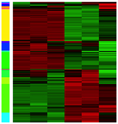
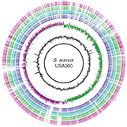



## Gene regulation in host defense

We carry out global transcriptional profiling of cells and tissues to identify the full complement of genes involked in response to intracellular infection or to distinct inflammatory signals (cytokines).  Bioinformatics and statistical tools are used to mine this data to identify key regulators of host immunity. Our efforts in this area have led to the identification of key pathways involved in pathogenesis during infection with _[Leishmania](http://hostmicrobe.github.io/myPapers/Leish_humanLeison_arrays.pdf)_, _[Toxoplasma](http://journals.plos.org/plosone/article?id=10.1371/journal.pone.0088398)_ and _[Trichinella](http://www.plospathogens.org/article/info:doi/10.1371/journal.ppat.1005347)_.  We also interrogate immune signaling pathways using cell-based screening with large siRNA or cDNA libraries, which recently led to the identification of a [key modulator of Interferon-induced gene expression](http://bit.ly/1QRaApg).

## Pathogen genomics

Host immune responses represent only one side of the host-pathogen coin.  We believe that understanding these complex interactions requires an interdisciplinary approach that gives equal scrutiny to the biology of the pathogen.  Toward this end, we use a combination of genome sequencing, transcriptomics and comparative genomics (between strains or species of pathogens) to identify microbial programs associated with host disease.  Our _[recent efforts](http://hostmicrobe.github.io/myPapers/StaphDOXP.pdf)_ in this area have led to the discovery of a novel strategy for treating Staph infections in veterinary medicine.

## Microbial communities in health and disease

Despite our interest in pathogens, we recognize that most microbes do not cause disease.  In fact, there is a growing appreciation in microbiology that the large biomass of seemingly harmless bacteria that we harbor -- our so-called microbiome -- may be a critical factor in tipping the scales from health to disease.  We use 16S marker gene sequencing and shotgun metagenomics to study microbial communities in both mouse and large animal models (dog, as well as agricultural species), in order to better understand the role these microbes play in spontaneous disease development.  

